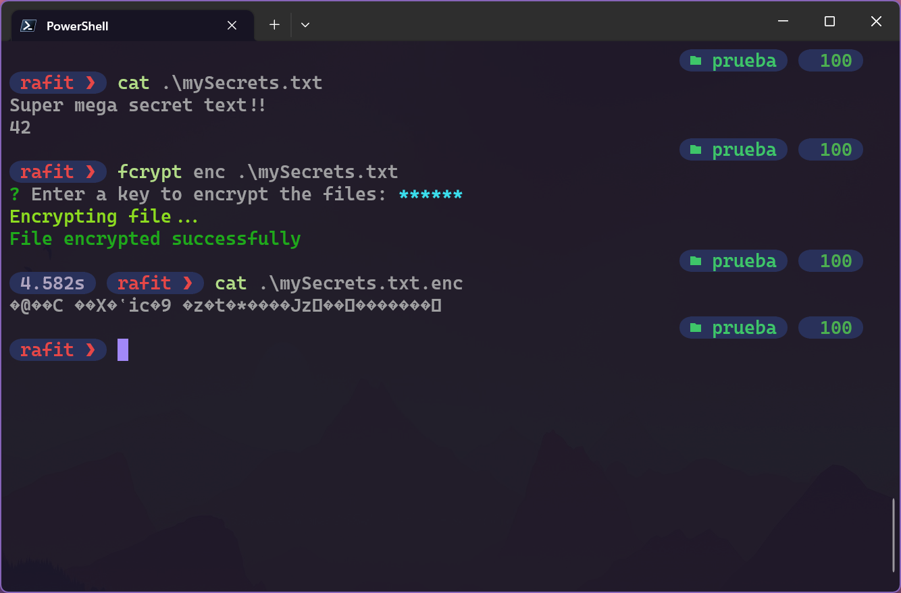
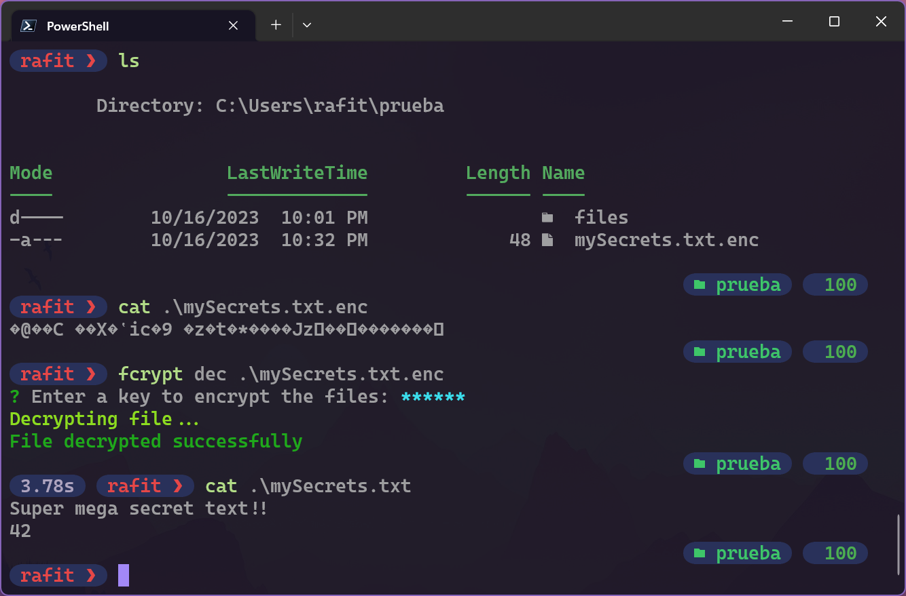
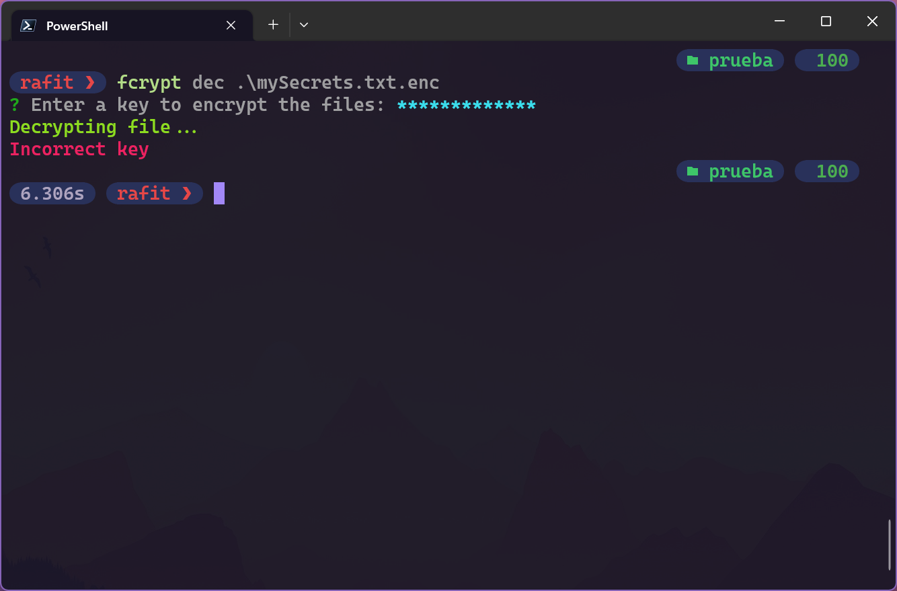

# Fcrypt

Fcrypt is a simple CLI tool to encrypt and decrypt files using AES-256-CBC algorithm. It is written in Node.js and uses the built-in crypto module.

## Installation

```bash
npm install -g fcrypt
```

## Usage

```bash
fcrypt <command> <path>
```

| Command   | Description                                                                                                                            |
| --------- | -------------------------------------------------------------------------------------------------------------------------------------- |
| enc       | Enc command allows you to encrypt the file that you specify. If you specify a directory, all files in the directory will be encrypted. |
| dec       | Dec command allows you to decrypt the file that you specify. If you specify a directory, all files in the directory will be decrypted. |
| help, -h  | Help command displays the help menu                                                                                                    |
| --version | Version command displays the version of fcrypt                                                                                         |

## Examples

```bash
fcrypt enc ./file.txt
fcrypt dec ./file.txt.enc
```

### Encryption example



### Decryption example



## Wrong secret key

**NOTE**: After running the above commands, you will be prompted to enter a secret key. The secret key is used to encrypt and decrypt the files. The secret key is not stored anywhere and is only used to encrypt and decrypt the file(s). Keep in mind that if you lose or forget the secret key, you will not be able to decrypt the file. So make sure you remember the secret key.



## License

Fcrypt is licensed under the MIT License. See [LICENSE](LICENSE) for more information.
